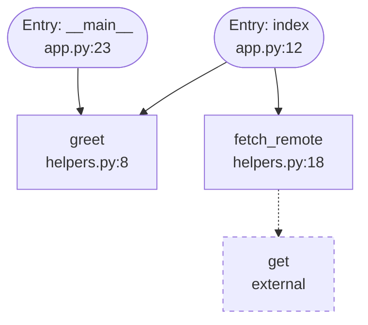

# codetodiagram

Generate Mermaid flowcharts from Python call graphs, starting at real entry points.

[](https://github.com/fahd12/codetodiagram/actions/workflows/ci.yml)
[](https://pypi.org/project/codetodiagram/)
[](https://pypi.org/project/codetodiagram/)
[](LICENSE)

## The problem

Import graphs show which file depends on which file. They do not show how a request or a CLI command actually runs. `codetodiagram` traces calls from detected entry points and draws that path.

No LLM, no API keys, no network at runtime. Output is deterministic for the same source.

## Install

```bash
pip install codetodiagram
```

Requires Python 3.10+.

## Quickstart

```bash
codetodiagram path/to/project
codetodiagram path/to/project --entry index --output diagram.mmd
```

GitHub repos must be cloned first; the CLI only reads a local path.

## Example



Full fixture output: [docs/example-output.md](docs/example-output.md).

## CLI

| Flag | Default | Meaning |
|------|---------|---------|
| `path` | required | Directory or `.py` file |
| `--entry NAME` | all entries | Repeatable; subgraph from this entry |
| `--max-depth N` | `10` | Call hops from each entry |
| `--max-nodes N` | `50` | Drop least-connected nodes beyond this |
| `--output FILE` | stdout | Write Mermaid or JSON |
| `--format mermaid\|json` | `mermaid` | Output format |
| `--exclude GLOB` | none | Repeatable path filter |
| `--verbose` | off | Progress on stderr |
| `--version` | | Print version |

Exit codes: `0` success, `1` error, `2` no entry points found.

### GitHub Actions

```yaml
- uses: actions/checkout@v4
- run: pip install codetodiagram
- run: codetodiagram . --output diagram.mmd
```

## How it works

1. Walk `.py` files (skips `.venv`, `__pycache__`, `.git`, `build`, `dist`, …).
2. Parse with the stdlib `ast` module and build a symbol table.
3. Resolve direct calls, `self`/`cls` methods, and imports. Unknown callees become external nodes.
4. Detect entries: `if __name__ == "__main__"`, Flask/FastAPI routes, Click/Typer commands, Celery tasks.
5. Bounded DFS from those entries, then render Mermaid (`flowchart TD`).

Node IDs are hashes of fully-qualified names so diffs stay stable.

## Limitations

- Python only in v0.1. The analyzer interface is built so TypeScript can be added later.
- Static analysis: dynamic dispatch, `getattr` targets, and runtime imports are not followed.
- Builtins such as `str` / `int` may appear as external nodes.
- Large trees are truncated at `--max-nodes` (note in the output).

## Contributing

Dev install: `pip install -e ".[dev]"`. Then `ruff check src tests`, `mypy`, and `pytest --cov=codetodiagram.analyzer --cov=codetodiagram.renderer --cov-fail-under=80`.

## License

MIT. See [LICENSE](LICENSE).
